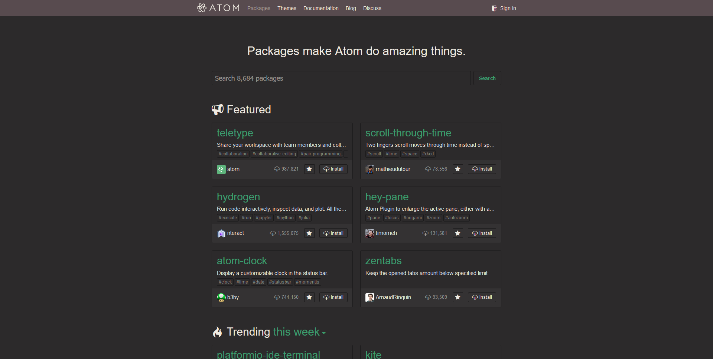

# Atom.io Dark Theme

## Overview

This is a dark themed [usercss](https://github.com/openstyles/stylus/wiki/Usercss) style for the Atom.io website.

### Preview

[Click to see more!](./preview)

## Installation

Install the [Stylus](https://github.com/openstyles/stylus) Browser Extension.

-   [Firefox](https://addons.mozilla.org/en-US/firefox/addon/styl-us/)
-   [Chrome](https://chrome.google.com/webstore/detail/stylus/clngdbkpkpeebahjckkjfobafhncgmne)
-   [Opera](https://addons.opera.com/en-gb/extensions/details/stylus/)

Install the Atom.io Dark Theme.

-   [usercss](./atomiodark.user.css)

## License

This project is licensed under the [MIT License](./LICENSE) © [TheBillyIsMe](https://github.com/TheBillyIsMe)
